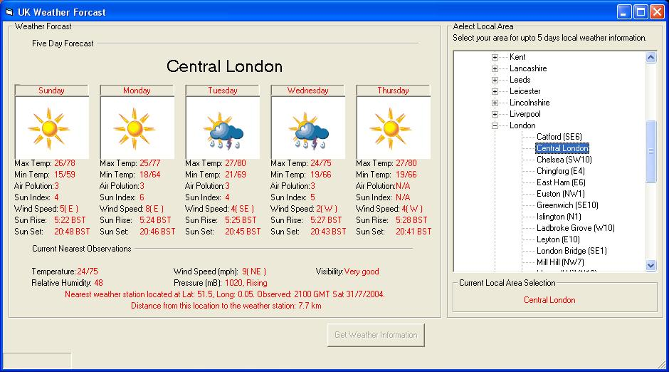



## Get UK Weather

### Description

This code will let the user select their town in a tree view panel, then by double clicking the name of their town and then clicking the button a 5 day weather forecast is displayed
 
### More Info
 
quite slow when searching through the HTML for all the weather information

             |
---                |---
**Submitted On**   |2004-07-31 17:31:42
**By**             |[Stu Lishman](https://github.com/Planet-Source-Code/PSCIndex/blob/master/ByAuthor/stu-lishman.md)
**Level**          |Intermediate
**User Rating**    |5.0 (25 globes from 5 users)
**Compatibility**  |VB 5\.0, VB 6\.0
**Category**       |[Miscellaneous](https://github.com/Planet-Source-Code/PSCIndex/blob/master/ByCategory/miscellaneous__1-1.md)
**World**          |[Visual Basic](https://github.com/Planet-Source-Code/PSCIndex/blob/master/ByWorld/visual-basic.md)
**Archive File**   |[Get\_UK\_Wea1776097312004\.zip](https://github.com/Planet-Source-Code/stu-lishman-get-uk-weather__1-55263/archive/master.zip)

